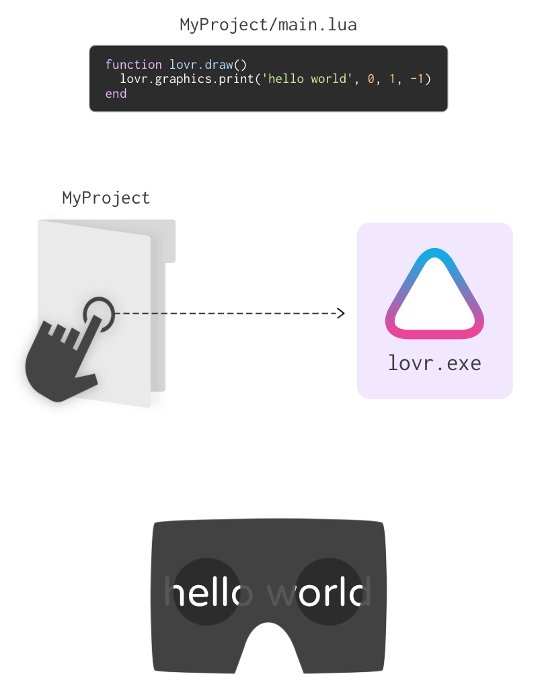
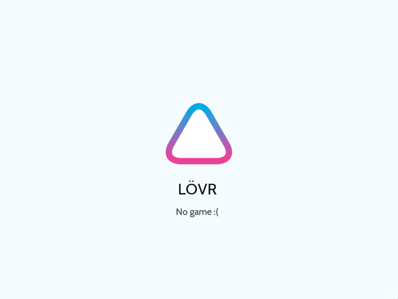
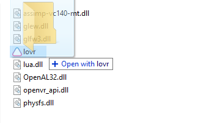

<!--
category: guide
-->

Getting Started
===

This guide will teach you how to install LÖVR, create a project, and run it. TL;DR version:



Installing LÖVR
---

First, download LÖVR from the home page or click [here](http://bjornbyt.es/f/lovr.zip).  Extract the
zip archive and open up the folder.  You should see the `lovr.exe` executable and a bunch of `.dll`
files.


Double click on `lovr.exe` to open LÖVR.  You should see a window with the LÖVR logo in it.  This is
what's shown if you run LÖVR without specifying a project.



> Note: If you're using a VR headset, you may see a blank window if your headset isn't
> pointing in the forward direction.  That's fine!

We're going to make a project so we see something more interesting than the default screen.

Creating a Project
---

A LÖVR project is just a folder.  The folder can have anything necessary for your app, like 3D
models, sound files, or Lua code.  There isn't any required structure for the folder, so you can
organize it however you want.

There is one special file that LÖVR looks for though, called `main.lua`.  If you put a `main.lua`
file in your project folder, LÖVR will run the code in there when the project starts.

Create a file called `main.lua` in a project folder and type the following Lua code in it:

```
function lovr.draw()
  lovr.graphics.print('hello world', 0, 1.7, -3, .5)
end
```

Don't fret if you're confused about the code, it's not important to understand all of it right now.
In short, we declared the `lovr.draw` function and used `lovr.graphics.print` in there to render
some text on the screen in 3D space every frame.  We'll learn more about what's going on in the next
guide.

Running a Project
---

To run a LÖVR project, drop its folder onto `lovr.exe`.  You can also run `lovr.exe` from the
command line and pass the path to the project as the first argument.



If you followed the example above, you should see the following in VR:


That's all there is to it!

Next Steps
---

The next guide will teach you how to make more sophisticated projects using [Callbacks]().

If you want to learn more about Lua, some good resources are:

1. [Learn Lua in 15 Minutes](http://tylerneylon.com/a/learn-lua/)
2. [Lua for Programmers](http://nova-fusion.com/2012/08/27/lua-for-programmers-part-1/)

To see some more examples of what LÖVR can do, check out the [Examples]() gallery.
